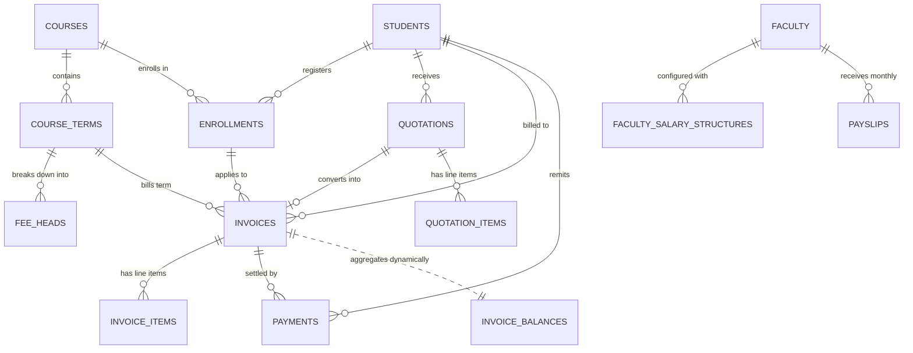
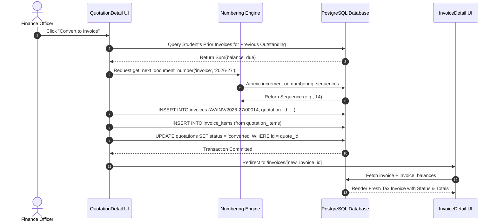
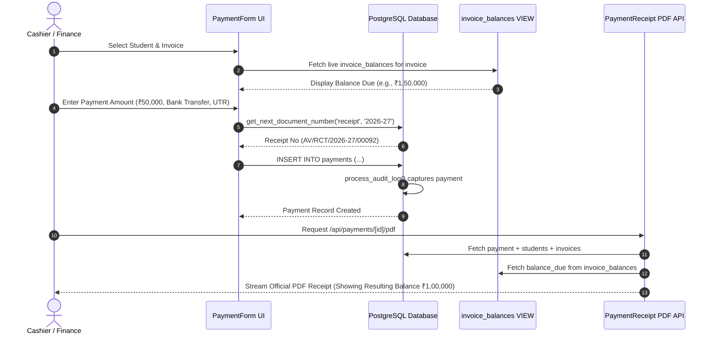

# AVIORA — System Architecture & Technical Design Document

**System Name:** AVIORA (Aviation Finance & Fee Management System)  
**Organization:** Aviora Aviation Academy  
**Version:** 1.0 (Phase 1–12 Production)  
**Classification:** Internal Enterprise Financial Infrastructure  

---

## 1. Executive Summary & Architectural Overview

**AVIORA** is an enterprise-grade financial operations, fee management, student billing ledger, and faculty payroll system engineered specifically for commercial flight academies. Aviation training operations involve complex financial workflows including multi-term flight training syllabi, variable hourly aircraft simulator charges, structured student tuition payments, scholarship/promotional deductions, atomic sequenced tax invoicing, and faculty flight instructor payroll.

```
+---------------------------------------------------------------------------------------+
|                                    CLIENT BROWSER                                     |
|  [ Next.js 16 App Router (React 19 Server & Client Components) + Tailwind CSS + Lucide ]|
|  [ TanStack React Query v5 (Caching, Invalidation, Dynamic Merging & Optimistic State)]|
+---------------------------------------------------------------------------------------+
                                           │
                       HTTPS / REST / PostgREST / SSR RPC
                                           │
                                           ▼
+---------------------------------------------------------------------------------------+
|                               NEXT.JS SERVER RUNTIME                                  |
|  • Dynamic Server Routes (/api/invoices/[id]/pdf, /api/payments/[id]/pdf, etc.)       |
|  • @react-pdf/renderer Engine with Unified Branding Header & Signature Partials       |
|  • Supabase SSR Client (@supabase/ssr) with Cookie Session Validation                 |
|  • Edge Middleware Authentication Proxy                                               |
+---------------------------------------------------------------------------------------+
                                           │
                                 Supabase Connection
                                           │
                                           ▼
+---------------------------------------------------------------------------------------+
|                              SUPABASE / POSTGRESQL 15+                                |
|  • PostgreSQL Storage: Relational Tables with NUMERIC(12,2) Currency Precision         |
|  • Dynamic Aggregation View: invoice_balances (Real-time Balance Due & Status)        |
|  • Atomic Stored Procedures: get_next_document_number (Row-locked Sequence Engine)     |
|  • Financial Triggers: process_audit_log (Immutable JSONB Audit History)              |
|  • Storage Bucket: student-photos (Public CDN image asset hosting)                    |
|  • Row-Level Security (RLS) Enforced Across All Relational Schemas                    |
+---------------------------------------------------------------------------------------+
```

---

## 2. Technology Stack & Key Architectural Decisions

| Layer | Technology | Version / Spec | Purpose & Architectural Rationale |
|---|---|---|---|
| **Frontend Framework** | Next.js App Router | 16.3.0 (Turbopack) | Server & Client hybrid rendering, route groups `(app)` & `(auth)`, streaming metadata. |
| **UI Library** | React | 19.2.8 | Concurrent rendering, modern hooks, form actions. |
| **State & Cache** | TanStack React Query | v5.101.4 | Remote server-state caching, automatic cache invalidation on mutations, two-step entity merging. |
| **Styling Engine** | Tailwind CSS | v4.x PostCSS | Custom color palette (`navy-900`, `navy-800`, `navy-700`, `accent`), responsive flex/grid layouts. |
| **PDF Generator** | `@react-pdf/renderer` | v4.5.1 | Server-side binary PDF streaming for quotations, invoices, receipts, and payslips. |
| **Form Handling** | React Hook Form + Zod | v7.84.0 / v4.4.3 | Type-safe form validation, dynamic line-item arrays, real-time math computation. |
| **Backend & DB** | Supabase (PostgreSQL) | PostgreSQL 15+ | Relational persistence, JSONB snapshots, stored procedures, RLS, trigger audit logs. |
| **Auth** | Supabase Auth + SSR | `@supabase/ssr` 0.12.4 | JWT sessions, HttpOnly cookies, secure server-side session resolution. |
| **Icons** | Lucide React | v1.30.0 | High-contrast visual cues for status badges, finance cards, and navigation. |

---

## 3. Core Architectural Principles & Invariants

### 3.1 Strict Numeric Currency Representation (`NUMERIC(12,2)`)
To eliminate binary floating-point representation errors inherent to JavaScript IEEE 754 numbers and SQL `FLOAT`/`DOUBLE PRECISION`:
- **Database Rule:** Every single financial column (`subtotal`, `grand_total`, `discount_amount`, `scholarship_amount`, `gst_amount`, `amount_paid`, `balance_due`, `basic`, `hra`, `net_pay`) is strictly declared as `NUMERIC(12,2)`.
- **Client Rule:** Client-side financial operations pass through `roundCurrency(val)` and `formatCurrency(val)` from `@/lib/utils/currency.ts` using `Intl.NumberFormat('en-IN')` standard.

### 3.2 Derived Balances Single Source of Truth (`invoice_balances` View)
Outstanding balances, paid totals, and settlement statuses are **never** stored as mutable columns on `invoices`. They are dynamically aggregated from the transaction ledger:
$$\text{amount\_paid} = \sum \text{payments.amount}$$
$$\text{balance\_due} = \text{grand\_total} - \text{amount\_paid}$$
$$\text{computed\_status} = \begin{cases} 
\text{'draft'} & \text{if } \text{status} = \text{'draft'} \\
\text{'cancelled'} & \text{if } \text{status} = \text{'cancelled'} \\
\text{'paid'} & \text{if } \text{balance\_due} \le 0 \\
\text{'partial'} & \text{if } \text{amount\_paid} > 0 \text{ and } \text{balance\_due} > 0 \text{ and } \text{due\_date} \ge \text{CURRENT\_DATE} \\
\text{'overdue'} & \text{if } \text{balance\_due} > 0 \text{ and } \text{due\_date} < \text{CURRENT\_DATE} \\
\text{'sent'} & \text{otherwise}
\end{cases}$$

### 3.3 Two-Step Fetch-and-Merge Query Pattern
Because PostgreSQL aggregate views (`invoice_balances`) do not contain foreign key constraints for PostgREST embedded joins, the application implements the two-step fetch-and-merge pattern across all client and server queries:
1. Fetch base records (`invoices`, `payments`, `students`) with standard relational joins.
2. Fetch corresponding rows from `invoice_balances` using `.in('invoice_id', ids)` or `.eq('invoice_id', id)`.
3. Construct an in-memory `Map` keyed by `invoice_id` and merge `invoice_balances` onto each invoice entity.

### 3.4 Concurrency-Safe Atomic Document Numbering
Document sequences must never produce duplicates, race conditions, or gaps:
- Handled by the atomic PostgreSQL stored procedure `get_next_document_number(p_doc_type, p_fy_label)`.
- Uses `INSERT ... ON CONFLICT (doc_type, fy_label) DO UPDATE SET last_number = last_number + 1 RETURNING last_number`.
- Format patterns:
  - Quotations: `AV/QT/00001`
  - Invoices: `AV/INV/2026-27/00001`
  - Receipts: `AV/RCT/2026-27/00001`
  - Payslips: `AV/PAY/2026-27/00001`

### 3.5 Immutable Historical Payslip Snapshots
Faculty compensation structures evolve over time. Modifying a faculty member's salary structure must never mutate historically generated payslips.
- `payslips` stores an immutable frozen JSONB snapshot `salary_structure_snapshot` at the time of payslip generation.
- Unique constraint `UNIQUE (faculty_id, month, year)` prevents duplicate disbursements for the same calendar month.

---

## 4. Frontend Architecture & Directory Layout

```
src/
├── app/
│   ├── (auth)/
│   │   └── login/
│   │       └── page.tsx                     # Authentication Login Screen
│   ├── (app)/
│   │   ├── layout.tsx                       # Authenticated Shell (Sidebar + Navigation + Session)
│   │   ├── dashboard/
│   │   │   ├── page.tsx                     # Server metadata wrapper
│   │   │   └── DashboardClient.tsx          # Real-time KPIs, Breakdown & Recent Activity
│   │   ├── students/
│   │   │   ├── page.tsx / StudentList.tsx   # Student Directory & Search
│   │   │   └── [id]/
│   │   │       ├── page.tsx / StudentProfile.tsx # Student Bio & Enrollment Cards
│   │   │       └── StudentFeeLedgerSection.tsx   # Real-time Student Financial Ledger
│   │   ├── courses/
│   │   │   └── page.tsx / CourseList.tsx    # Aviation Course & Multi-Term Fee Configurator
│   │   ├── quotations/
│   │   │   ├── page.tsx / QuotationList.tsx # Quotations Register & Lifecycle Management
│   │   │   ├── new/page.tsx / QuotationForm.tsx # Flight Quotation Creator
│   │   │   └── [id]/
│   │   │       ├── page.tsx / QuotationDetail.tsx # Quotation Inspector & Conversion Engine
│   │   │       └── edit/EditQuotationClient.tsx # Quotation Editor
│   │   ├── invoices/
│   │   │   ├── page.tsx / InvoiceList.tsx   # Tax Invoice Directory with Live Status Filters
│   │   │   ├── new/page.tsx / InvoiceForm.tsx # Term Tax Invoice Generator & Auto-Outstanding Pull
│   │   │   └── [id]/
│   │   │       ├── page.tsx / InvoiceDetail.tsx # Invoice Hub, Balances, Payment History
│   │   │       └── edit/EditInvoiceClient.tsx # Invoice Modification
│   │   ├── payments/
│   │   │   ├── page.tsx / PaymentList.tsx   # Master Payment Register & Receipts
│   │   │   └── new/page.tsx / PaymentForm.tsx # Payment Recorder & Open Invoice Allocator
│   │   ├── faculty/
│   │   │   ├── page.tsx / FacultyList.tsx   # Flight Instructors & Faculty Roster
│   │   │   └── [id]/FacultyDetailClient.tsx # Salary Structure History & Configurator
│   │   ├── payslips/
│   │   │   ├── page.tsx / PayslipList.tsx   # Monthly Payroll Register
│   │   │   ├── new/PayslipGenerator.tsx     # Monthly Payslip Batch Generator
│   │   │   └── [id]/PayslipDetail.tsx       # Payslip Inspector & Earning/Deduction Breakdown
│   │   ├── reports/
│   │   │   └── page.tsx / ReportsClient.tsx # Date-Range Financial Audit Hub & CSV Exports
│   │   ├── settings/
│   │   │   └── page.tsx / SettingsClient.tsx# Official Academy Profile, Banking & PDF Branding
│   │   └── test-numbering/
│   │       └── TestNumberingClient.tsx      # Concurrency & Sequence Verification Utility
│   ├── api/                                 # Server-side Streaming PDF Endpoints
│   │   ├── quotations/[id]/pdf/route.ts
│   │   ├── invoices/[id]/pdf/route.ts
│   │   ├── payments/[id]/pdf/route.ts
│   │   └── payslips/[id]/pdf/route.ts
│   ├── globals.css                          # Tailwind PostCSS configuration
│   └── layout.tsx                           # Root HTML, Fonts & Toast Provider
├── components/
│   ├── layout/
│   │   ├── AppHeader.tsx                    # User Profile & Logout Header
│   │   └── Sidebar.tsx                      # Primary Navigation Shell
│   ├── providers/
│   │   └── Providers.tsx                    # React Query Client & Toast Context
│   └── ui/
│       ├── Modal.tsx                        # Reusable Accessible Dialog
│       ├── Skeleton.tsx                     # Shimmer Loading Placeholders
│       ├── StatusBadge.tsx                  # Color-coded Financial Status Pill
│       └── Toast.tsx                        # Global Toast Notification System
├── lib/
│   ├── invoices/calculations.ts             # Invoice subtotal, discount, scholarship, GST math
│   ├── numbering/generator.ts               # Atomic numbering client wrappers
│   ├── payroll/calculations.ts              # Gross, statutory deduction, and net pay formulas
│   ├── pdf/
│   │   ├── branding.tsx                     # Shared PDF Header, Bank Info & Signature Footer
│   │   ├── QuotationPdfDocument.tsx         # Quotation PDF Document Template
│   │   ├── InvoicePdfDocument.tsx           # Tax Invoice PDF Document Template
│   │   ├── PaymentReceiptPdfDocument.tsx    # Official Payment Receipt PDF Template
│   │   └── PayslipPdfDocument.tsx           # Monthly Salary Slip PDF Template
│   ├── supabase/
│   │   ├── client.ts                        # Browser Supabase Client
│   │   ├── server.ts                        # SSR Cookie-aware Supabase Client
│   │   └── middleware.ts                    # Edge Session Refresher
│   └── utils/
│       ├── currency.ts                      # formatCurrency, roundCurrency, numberToWordsINR
│       └── dates.ts                         # Financial year labels, date formatters
└── types/
    └── database.ts                          # Full TypeScript Database Schema & Interface Definitions
```

---

## 5. Backend & Database Architecture (Supabase PostgreSQL)

### 5.1 Relational Schema Map



### 5.2 Database Schemas & Storage Objects

1. **`users`**: Extended application profiles tied to `auth.users(id)`.
2. **`company_settings`**: Global branding, academy registration, GSTIN, PAN, Bank IFSC, and signature assets.
3. **`courses` & `course_terms` & `fee_heads`**: Multi-term training course catalog and tuition breakdown.
4. **`students`**: Student directory with automatic admission sequence (`AV-YYYY-XXXX`).
5. **`enrollments`**: Student-course bindings with batch year and current term tracking.
6. **`numbering_sequences`**: Atomic document sequence ledger locked per `(doc_type, fy_label)`.
7. **`quotations` & `quotation_items`**: Pre-enrollment flight training cost estimates.
8. **`invoices` & `invoice_items`**: Formal GST tax invoices with multi-deduction discount logic.
9. **`payments`**: Real-time payment records, payment modes (UPI, Bank Transfer, Cheque, Cash), and receipts.
10. **`invoice_balances` (VIEW)**: Authoritative view calculating real-time amount paid, balance due, and computed status (`draft`, `sent`, `paid`, `partial`, `overdue`, `cancelled`).
11. **`faculty` & `faculty_salary_structures` & `payslips`**: Staff roster, historical compensation slabs, and frozen monthly payroll slips.
12. **`audit_logs`**: Trigger-backed audit ledger capturing `INSERT`, `UPDATE`, and `DELETE` JSONB payloads across all financial mutations.
13. **`student-photos` (Storage Bucket)**: Public Supabase Storage bucket for cadet profile photos.

---

## 6. Financial Lifecycle Data Flow & Workflows

### 6.1 Quotation to Invoice Conversion Flow


### 6.2 Payment Realization & Real-time Ledger Settlement Flow


---

## 7. Universal PDF Generation Engine Architecture

All 4 document types share a centralized, reusable branding partial located in `@/lib/pdf/branding.tsx`:
- **`PdfHeader`**: Renders dynamic Academy Name, Logo, Address, Contact Info, and GSTIN/PAN directly from `company_settings`.
- **`PdfBankDetails`**: Embeds Academy Bank Name, Account Number, and IFSC code for wire remittances.
- **`PdfSignatureFooter`**: Renders authorized signatory and computer-generated document legal disclaimers.

```
                  ┌──────────────────────────────┐
                  │    company_settings Table    │
                  └──────────────┬───────────────┘
                                 │
                                 ▼
                  ┌──────────────────────────────┐
                  │     @/lib/pdf/branding.tsx   │
                  │  • PdfHeader                 │
                  │  • PdfBankDetails            │
                  │  • PdfSignatureFooter        │
                  └──────┬───────────────┬───────┘
                         │               │
         ┌───────────────┼───────────────┼───────────────┐
         │               │               │               │
         ▼               ▼               ▼               ▼
┌─────────────────┐ ┌────────────────┐ ┌────────────────┐ ┌────────────────┐
│ QuotationPdfDoc │ │ InvoicePdfDoc  │ │ PaymentRcptDoc │ │ PayslipPdfDoc  │
│  /api/quotes/   │ │ /api/invoices/ │ │ /api/payments/ │ │ /api/payslips/ │
└─────────────────┘ └────────────────┘ └────────────────┘ └────────────────┘
```

---

## 8. Security, Row-Level Security & Audit Compliance

1. **Authentication:** Enforced at the Edge via Next.js Middleware and Supabase Auth JWT cookies. Unauthenticated requests are immediately routed to `/login`.
2. **Row-Level Security (RLS):** Enabled and strictly enforced on all 12 database tables. Only authenticated application tokens can execute read/write queries.
3. **Database Audit Logging:** An automatic PostgreSQL trigger `process_audit_log()` intercepts all financial mutations on `quotations`, `invoices`, `payments`, and `payslips`, capturing:
   - `action`: `INSERT`, `UPDATE`, or `DELETE`
   - `performed_by`: `auth.uid()` from the JWT session
   - `old_data`: Pre-mutation JSONB snapshot
   - `new_data`: Post-mutation JSONB snapshot
   - `created_at`: Exact server timestamp
4. **Zero Client Mutation of Financial Status:** Statuses like `paid`, `partial`, and `overdue` cannot be directly written by client requests. They are calculated dynamically by `invoice_balances`.
